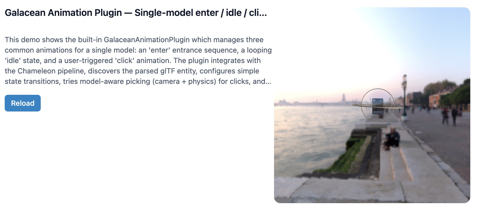
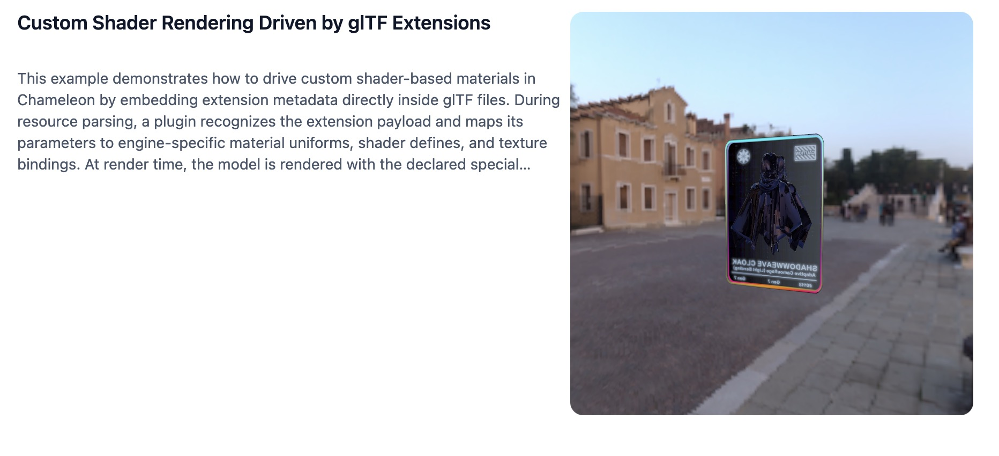

# Name: **Chameleon**

[](https://github.com/mochengdx/chameleon/actions/workflows/ci.yml) [](https://github.com/mochengdx/chameleon/actions/workflows/deploy-pages.yml)

Demo: https://mochengdx.github.io/chameleon/





Deployment:

- GitHub Pages: enable Pages and set Source = GitHub Actions (workflow: `.github/workflows/deploy-pages.yml`).
- Vercel: import the repo and set Root Directory = `apps` (config: `apps/vercel.json`).

## Overview:

**Chameleon** is a flexible and highly extensible 3D rendering and interaction framework designed to work seamlessly across various WebGL engines, including Three.js, Galacean, and more. It provides a modular pipeline that allows developers to load, render, and interact with 3D models efficiently, while also enabling custom extensions and interactions.

With **Chameleon**, developers can easily load complex 3D models (e.g., GLTF) and control their size, rotation, and position via intuitive touch or mouse interactions. The project supports multi-stage rendering pipelines, from initialization and resource loading to rendering and post-processing. Additionally, it offers a powerful plugin system that allows for the dynamic addition of custom shaders, materials, or rendering effects.

The framework is designed with scalability in mind, making it suitable for both small-scale applications and large-scale 3D visualization projects. Real-time model manipulation, debugging tools, and seamless engine adaptation are core features of **Chameleon**, providing a rich user experience for both developers and end-users.

---

## Key Features:

- **Cross-Engine Compatibility:** Built to work with WebGL engines like Three.js, Galacean, and others, making it highly adaptable for different project needs.
- **Interactive 3D Controls:** Enable intuitive manipulation of models with touch or mouse input for zooming, rotating, and translating.
- **Modular Architecture:** Highly extensible pipeline where each stage of the process (e.g., model loading, rendering, post-processing) can be customized and extended with plugins.
- **Real-Time Debugging:** Built-in tools for developers to visualize the rendering pipeline, log events, and inspect model states during the development process.
- **Plugin Support:** Easily extendable with custom plugins for shaders, materials, or other rendering effects.
- **Optimized for Performance:** Lightweight and efficient, with optimization strategies that reduce CPU and GPU load for smoother user experiences.

---

## Perfect For:

- **3D Model Visualization:** For games, interactive websites, and AR/VR applications.
- **Custom Render Pipelines:** Extend existing engines with specific rendering requirements.
- **Interactive Content:** Provide rich, real-time user interaction with 3D models and scenes.

---

**Chameleon** is designed to give developers full control over the 3D experience, whether they are building simple models or complex, interactive 3D environments.

---

## Quick Start

Prerequisites:

- Node.js `>= 18.12` (this repo uses `pnpm@10`)
- `pnpm` installed

```bash
pnpm install

# run the demo app
pnpm run dev:apps

# run devtools (optional)
pnpm run dev:devtools

# run tests
pnpm run test

# build workspace packages
pnpm run build
```

Demo app source lives in `apps/`.
